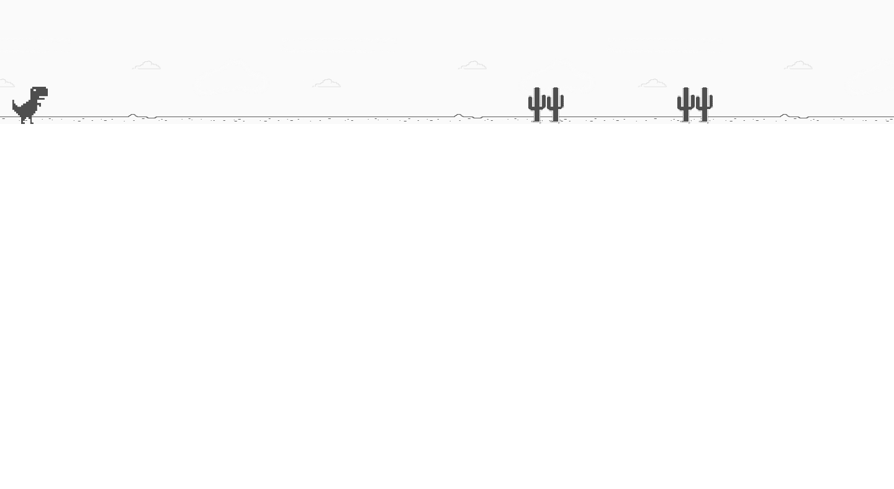

# Dinosaur Game

This is a simple 2D game developed using HTML, CSS, and JavaScript. The game is similar to the popular offline game on Google Chrome where a dinosaur runs and jumps over cacti and other obstacles. The objective of the game is to score as many points as possible by jumping over obstacles without colliding with them.

## Installation

1. Clone the repository: `git clone https://github.com/Burntroll/dinosaur-game.git`
2. Navigate to the project directory: `cd dinosaur-game`
3. Open the index.html file in your preferred browser.

Alternatively, you can play the game online by visiting the following link: <Im going to host on a website soon>

## Usage

This game was created for entertainment and fun purposes only. The objective of the game is to score as many points as possible by jumping over obstacles without colliding with them. The player can control the dinosaur using the **Spacebar** key to jump over obstacles.

## Technologies Used

- HTML
- CSS
- JavaScript

## Acknowledgements

- This game was inspired by the offline game on Google Chrome.

## License

This project is licensed under the [MIT License](https://opensource.org/licenses/MIT).

## Results

